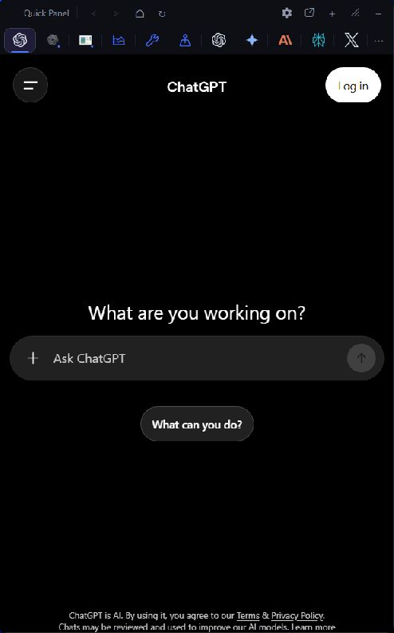

# Quick Panel

**Your everyday tools, one shortcut away.**

> **Source preview — Windows binary release pending.** This repository contains
> the 2.5.0 candidate source. A signed public download is not available yet.
> Signing and clean-user GUI acceptance remain release gates.
> See [release status](docs/release-status.md).

## What is Quick Panel?

Quick Panel is a compact Windows workspace for frequently used websites,
separate browser profiles, system information, and supported desktop apps.
Press **Ctrl + Alt + G** to show or hide the panel.

Keep favorite websites together, separate work and personal browser sessions,
and bring useful tools into view from one place. Add your own websites; the
initial default tabs include several AI services.

## Screenshot or demo



Actual 2.5.0 candidate captured in a disposable Windows VM with a fresh profile.
Signing and the remaining release checks are pending. See the
[capture details](docs/media/2.5.0/README.md).

## Major features

- Website tabs with persistent WebView2 sessions, custom icons, zoom, pins,
  ordering, and closed-tab history.
- Named browser profiles for separate work and personal account sessions.
- Built-in Task Manager, hardware telemetry, Windows Helper, Trip Planner,
  and optional Codex Usage panels.
- Session docking for supported desktop windows, with a compatibility path
  for apps that cannot safely be hosted as child windows.
- Opt-in startup and updates with SHA-256 verification and guarded recovery.

Hardware metrics depend on available sensors and permissions. Docking support
varies by application; see [compatibility notes](EXTERNAL-APPS.md).

## Download and installation

**There is no public binary release yet.** Development builds and workflow
artifacts are not signed, generally available releases.

The planned package is `QuickPanel-2.5.0-win-x64.zip`: a self-contained Windows
x64 application requiring Microsoft Edge WebView2 Runtime. Supported Windows
versions and tested environments will be recorded with the release.

Developers can build using the commands below. Run development builds on a
**disposable Windows user or VM**: startup can migrate a legacy profile. Do not
use a daily-use profile for release testing.

## Keyboard shortcut

Use `Ctrl + Alt + G` to show or hide Quick Panel. Escape hides it.

- `Ctrl + T`: add a website tab.
- `Ctrl + Tab` / `Ctrl + Shift + Tab`: switch tabs.
- `Ctrl + 1` through `Ctrl + 9`: select a tab by position.
- `Ctrl + W` / `Ctrl + Shift + T`: close or restore a custom tab.
- `Ctrl + Plus`, `Ctrl + Minus`, `Ctrl + 0`: adjust or reset web zoom.
- `Ctrl + R` or `F5`: reload the selected web tab.

## Adding websites

Select **+**, enter a name and URL, and choose **Add tab**. Automatic icons come
from the loaded page and are cached locally. Manual icon choices override them.
Tabs with the same name or URL keep their own saved state.

## Browser profiles

Use Add/Edit dialogs or a tab context menu to select or create a named browser
profile. Tabs in the same profile share sessions; different profiles keep
browser sessions separate. The Default profile remains available.

Profiles organize accounts; they are not an operating-system security boundary.
See [privacy information](PRIVACY.md).

## Window docking

**Dock a window** selects a supported open window, app, or file. Session tabs
are temporary. Normal undocking or exit restores the original window state.

File Explorer opens the selected physical folder in a separate in-panel Shell
view without reparenting the original window. Elevated, protected, secure-desktop,
and other unsupported windows are excluded. See [EXTERNAL-APPS.md](EXTERNAL-APPS.md).

## Updates

The public updater checks this repository's future GitHub Releases without
GitHub CLI or private credentials. Until the first release exists, its default
update check has no published version to retrieve.

Legacy installations need the verified 2.4.13 compatibility bridge before an
in-app upgrade to the renamed 2.5.0 package. That bridge is still pending release
acceptance. Retain existing settings, browser profiles, and recovery material.

## Privacy and local data

Settings and browser state live under `%LOCALAPPDATA%\QuickPanel\data`.
Legacy `%LOCALAPPDATA%\AIQuickPanel\data` is retained during migration.

The app has no developer analytics endpoint. Loaded websites communicate with
their own providers. The optional Codex Usage feature reads local Codex
authentication state when refreshed. Read [PRIVACY.md](PRIVACY.md) for details.

Never upload browser profiles, cookies, authentication files, or unreviewed logs
to a public issue. Review screenshots and diagnostics before sharing.

## Troubleshooting

See [SUPPORT.md](SUPPORT.md) for setup and recovery. Report non-sensitive bugs
using this repository's [issue tracker](https://github.com/Terru03/QuickPanel-Downloads/issues).
Use [SECURITY.md](SECURITY.md) for confidential vulnerability reports.

## Development information

Quick Panel is a WPF application targeting .NET 8 for Windows. Install the .NET 8
SDK on Windows and run:

```powershell
dotnet restore .\QuickPanel.sln
dotnet build .\QuickPanel.sln --configuration Release --no-restore
dotnet run --project .\tests\QuickPanel.Tests.csproj --configuration Release --no-build
.\tests\profile-data-safety.tests.ps1
.\tests\public-release-safety.tests.ps1
```

Build workflows are manual-only and do not publish releases. See
[RELEASE.md](RELEASE.md) for packaging and [QA.md](QA.md) for acceptance checks.
This repository starts with a reviewed source snapshot; historical private
releases, diagnostic reports, and development history are not included.

The source is publicly viewable under the reserved-rights terms in [LICENSE](LICENSE).
**This is not an open-source license.** Third-party components retain their own
[licenses and notices](THIRD-PARTY-NOTICES.md).
