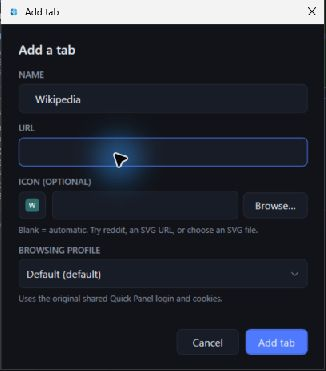
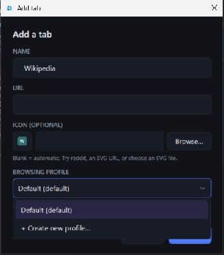

# Quick Panel 2.5.0 captures

These are genuine captures from a disposable Windows VM, using a fresh profile
and the 2.5.0 application. The workspace is signed out. The public release is
unsigned; these images do not imply a trusted signing identity.

The dialog captures show the actual controls and profile menu. They do not
demonstrate a completed website addition or session isolation. Only the native
dialog images are included; unrelated background panels are excluded.

## Provenance

- Application source: `42e8490febe528fe189c64401c6c3fe96d8a848c`.
- Executable file version: `2.5.0.0`.
- Captured candidate ZIP SHA-256:
  `258a721504a6756a44c8db170948e3f8e0003dfe44f5499a824eef1573cf7425`.
- The native capture is JPEG. No generated UI, account content, or retouched
  controls are presented as product behavior.

Workspace, add-website, and profile-menu captures are included. Utility and
docking captures and a complete demo recording remain pending.

Before binary publication, verify that the package uses the reviewed
application source shown here. If its UI or behavior changes, recapture the
affected screens. Keep raw diagnostics and local paths private.
